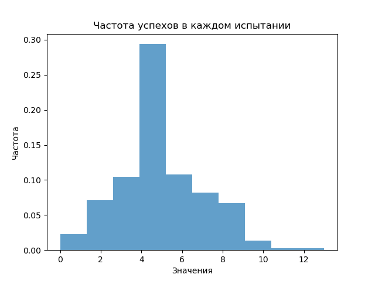
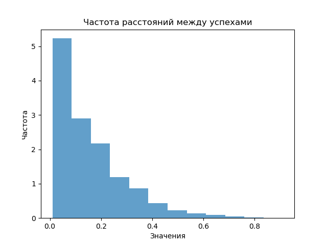
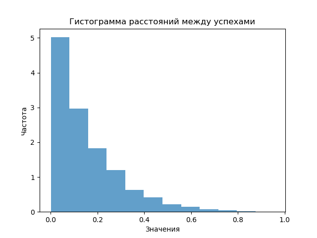
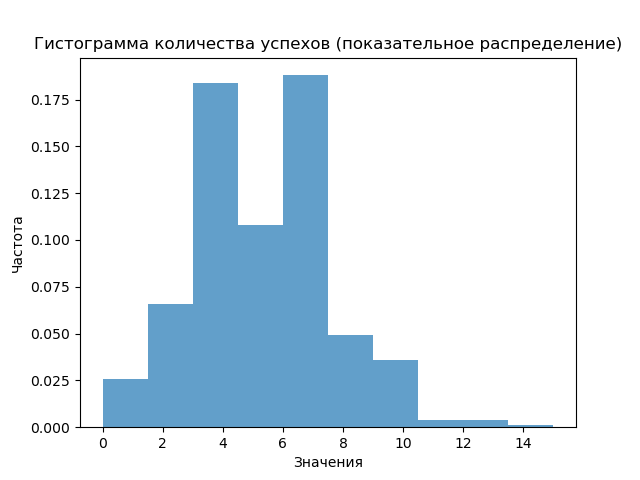
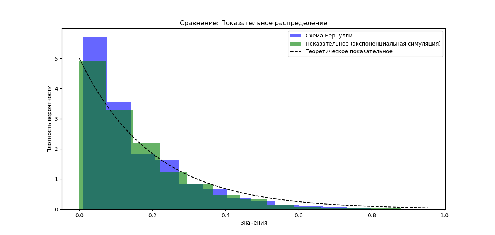
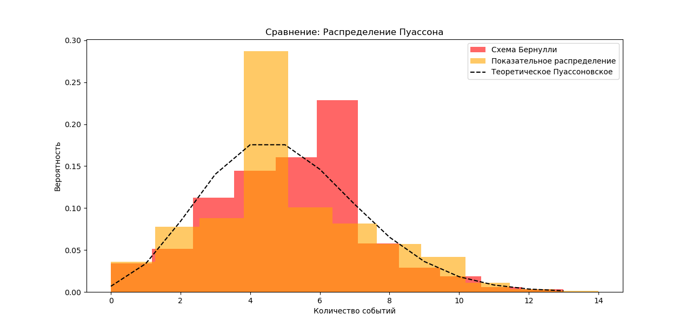

# Python задание 4: Пуассоновский процесс
**Суть**: Написать компьютерные алгоритмы, моделирующие:
 - *Схему Бернулли*
 - *Показательное распределение*
 - *Распределение Пуассона*

**Используемые формулы**:
- *Схема Бернулли*: 
  Описывает вероятность успеха в одном испытании.  
  $*P*(X = *k*) = *p*^*k* (1 - *p*)^{1 - *k*}, \quad *k* = 0, 1$
- *Биномиальное распределение*: 
  Используется для моделирования количества успехов в *n* независимых испытаниях.  
  $*P*(X = *k*) = \binom{*n*}{*k*} *p*^*k* (1 - *p*)^{*n* - *k*}$
- *Показательное распределение*: 
  Описывает время между событиями в процессе, где события происходят непрерывно и независимо.  
  $*f*(x; *λ*) = *λ* e^{- *λ* *x*}, \quad *x* ≥ 0$
- *Распределение Пуассона*: 
  Моделирует количество событий, происходящих за фиксированный интервал времени.  
  $*P*(X = *k*) = \frac{*λ*^*k* e^{- *λ*}}{*k*!}, \quad *k* = 0, 1, 2, \dots$


## Краткий обзор задач
- **Первое задание** моделирует расстановку успехов на отрезке $[0,1]$ и расстояния между успехами, в рамках *схемы Бернулли*, проверяя соответствие *биномиального* распределения *Пуассоновскому* для большого числа экспериментов Бернулли (кол-ва делений $n$).
- **Второе задание** использует *Пуассоновский процесс* для получения интервалов между успехами, для создавая *показательное распределение*.
- **Третье задание** наоборот, моделирует количество успехов с помощью *показательных интервалов*, приближаясь к *Распределению Пуассона*.
- **Четвёртое задание** (дополнительное) показывает отклонения компьютерных алгоритмов от математических ожиданий.

## Установка зависимостей
Для работы скриптов необходимы:
 - версия Python >= 3.5  из-за типизаций, например, `n: int`    
 Рекомендуется использовать Python 3.7 и выше, поскольку в этих версиях типизация была существенно улучшена, и поддержка различных аннотаций типов более стабильна.   
 - библиотеки `numpy`, `argparse` и `matplotlib`.   
**Установка через apt**:   
```bash
if ! python3 --version | grep -qE 'Python 3\.[7-9]|Python 3\.([0-9]{2,})'; then
    echo "Ошибка: Необходим Python версии 3.7 или выше."
fi

sudo apt update
sudo apt install -y python3    # Интерпретатор
sudo apt install -y python3-numpy python3-matplotlib    # библиотеки
```
**Установка через pip**:   
```bash
pip install numpy matplotlib
```


## Задание 1: Моделирование *Пуассоновского распределения* и *Показательного распределения* через *схему Бернулли*
**Суть**: Мы приближаем *Пуассоновский процесс* с параметром $\lambda$ через множество дискретных *испытаний Бернулли*.
 Это даёт нам способ изучить *Пуассоновское* и *Показательное* распределения как предельные случаи *схемы Бернулли*.


**Алгоритм**:   
 1. Задаём параметры $n$ (число отрезков) и $\lambda$ (среднее количество успехов).
 Определяем вероятность успеха на каждом отрезке $p = min⁡(\frac{\lambda}{n}, 1)$.   
 2. Разбиваем отрезок $[0,1]$ на $n$ равных частей, запуская для каждого *испытание Бернулли* с вероятностью успеха $p$.   
 3. Повторяем весь процесс $N$ раз, чтобы создать массивы:   
   - Количества успехов в каждом испытании (массив длины $N$).   
   - Расстояний между последовательными успехами для каждого испытания.   
 4. Строим гистограммы *количества успехов* и *расстояний между успехами*.   





## Задание 2: Моделирование *Показательного распределения* через *распределение Пуассона*
**Суть**: Здесь мы моделируем *расстояния между успехами*, распределёнными на отрезке $[0,1]$,
 используя *Пуассоновское распределение* для общего числа событий (успехов).
 Алгоритм иллюстрирует связь между *количеством успехов* и *интервалами* между ними.

**Алгоритм**:   
 1. Задаём параметр $\lambda$ (среднее количество успехов на интервале $[0,1]$).   
 2. Генерируем случайное количество успехов $X$ (число), используя *Пуассоновское распределение* с параметром $\lambda$.   
 3. Случайно размещаем $X$ точек на отрезке $[0,1]$ (генерация равномерных случайных чисел от 0 до 1 и их сортировка).   
 4. Находим расстояния между соседними точками (успехами).   
 5. Повторяем этот процесс $N$ раз,
 собираем расстояния между успехами 
 и строим их гистограмму для сравнения с *показательной плотностью* $\lambda e^{-\lambda t}$.   



## Задание 3: Моделирование *распределения Пуассона* через *Показательное распределение*
**Суть**: Используя *показательное распределение*, мы моделируем моменты, в которые происходят события в *Пуассоновском процессе*.
 Это показывает, что если времена между событиями распределены по показательному закону,
 то общее количество событий за фиксированный интервал будет распределено по Пуассону.

**Алгоритм**:   
 1. Задаём параметр $\lambda$.   
 2. Для каждого запуска (повторяя $N$ раз):   
 - Генерируем времена  между последовательными успехами, используя *показательное распределение* с параметром $\lambda$.   
 - Суммируем эти времена, пока их сумма не достигнет 1 (что имитирует события на интервале $[0,1]$).
 - Подсчитываем общее количество успехов (генерированных промежутков) за этот интервал.
 3. Собираем количество успехов для каждого из $N$ испытаний и строим гистограмму, сравнивая её с теоретическим *Пуассоновским распределением* с параметром $\lambda$.   



## Задание 4: Сравнение результатов алгоритмов
**Суть**: Сравнить гистограммы, построенные из первого, второго, третьего задания:   
 - *Показательное распределение* из первого и второго заданий;   
 - *распределение Пуассона* из первого и третьего заданий.   
 Никто не запрещает вычислить отклонение от математических формул.

**Алгоритм**:   
 1. Создать данные по заданиям 1, 2 и 3.  
 2. Построить гистограммы, отображающие созданные данные на одном графике для визуального сравнения:  
 - **Распределения Пуассона**, с помощью  количества успехов на всех итерациях  (задания 1 и 3)
 - **Показательного распределения**, с помощью  расстояний между успехами (задания 1 и 2)
 3. Добавляем на графики математические ожидания:
 - **Распределение Пуассона**: Нормальное распределение
 - **Показательное распределение**: Экспонента (гамма-распределение, при параметре формы $k=1$ )





## Использование
1. В `run-tasks.sh` включить нужные поля:
- RUN_TASK_1 (задание 1)
- RUN_TASK_2 (задание 2)
- RUN_TASK_3 (задание 3)
- RUN_PLOT_DEFLECTION (задание 4)
- RUN_PLOT_DEFLECTION_BIG (задание 4 с большими числами)
2. В директории `seminar4` запустить shell-скрипт: `./run-tasks.sh`

## Заключение
- Это задание по Теории Вероятностей продемонстрировало взаимосвязь между Пуассоновским и Показательным распределениями.  
- В этот README.md не удалось добавить большие математические формулы в формате LaTeX, например $$ P(X = k) = \frac{\lambda^k e^{-\lambda}}{k!} $$ (Распределение Пуассона), так как они не отображаются формулой.

